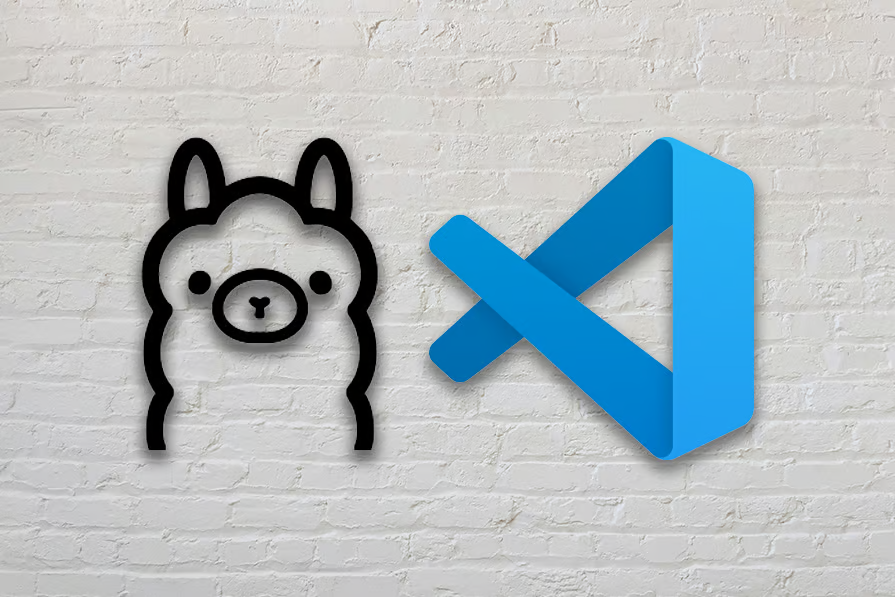
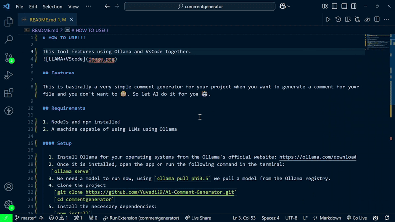

# HOW TO USE!!!

This tool features using Ollama and VsCode together.

## Features

This is basically a very simple comment generator for your project when you want to generate a comment for your file and you don't want to 😆. So let AI do it for you 🤖.

## Requirements

1. NodeJs and npm installed
2. A machine capable of using LLMs using Ollama  

#### Setup

  1. Install Ollama for your operating systems from the Ollama's official website: https://ollama.com/download
  2. Once it is installed, open the app or run the following command in the terminal:
   `ollama serve`
  3. We need a model to run now, using `ollama pull phi3.5` we pull a model from the Ollama registry.
  4. Clone the project
    `git clone https://github.com/Yuvadi29/Ai-Comment-Generator.git`
    `cd commentgenerator`
  5. Install the necessary dependencies:
    `npm install`
  6. Run the project in debug mode using `F5` or `CTRL + SHIFT + D`. It will open the Debug Window.
  7. Choose the project you want to go to and then select the line you want to comment.
  8. After selecting press `CTRL + SHIFT + P` and then choose Generate Comment.
  9. Your comment will be generated.

## Following extension guidelines

Ensure that you've read through the extensions guidelines and follow the best practices for creating your extension.

* [Extension Guidelines](https://code.visualstudio.com/api/references/extension-guidelines)

## Demo

**Do Not Forget to ⭐ the Repository if you like it!**
